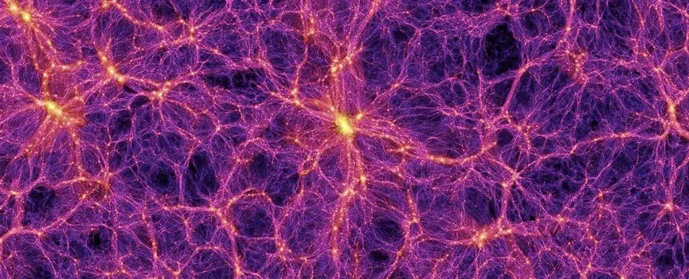
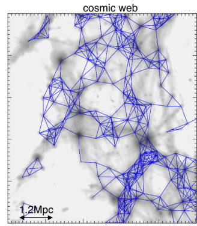

# Complex-Network-Analysis-for-General-Relativity-and-the-Cosmic-Web
Complex Network Analysis for General Relativity and the Cosmic Web

Tsizh, Maksym, Bohdan Novosyadlyj, Yurij Holovatch, and Noam I. Libeskind. 
"Large-scale structures in the ΛCDM Universe: network analysis and machine learning." 
Monthly Notices of the Royal Astronomical Society 495, no. 1 (2020): 1311-1320. https://arxiv.org/abs/1910.07868

De Regt, Robin, Stepan Apunevych, Christian Von Ferber, Yu Holovatch, and Bohdan Novosyadlyj. 
"Network analysis of the COSMOS galaxy field." Monthly Notices of the Royal Astronomical Society 
477, no. 4 (2018): 4738-4748. https://academic.oup.com/mnras/article/477/4/4738/4956047

Vazza, Franco, and Alberto Feletti. "The quantitative comparison between the neuronal network and the cosmic web."
 Frontiers in Physics 8 (2020): 491.  https://www.frontiersin.org/articles/10.3389/fphy.2020.525731/full?trk=public_post_comment-text

Krioukov, Dmitri, Maksim Kitsak, Robert S. Sinkovits, David Rideout, David Meyer, and Marián Boguñá. 
"Network cosmology." Scientific reports 2, no. 1 (2012): 793. https://www.nature.com/articles/srep00793 https://arxiv.org/abs/1203.2109

Understanding of complex networks could help unify gravity and quantum mechanics, https://phys.org/news/2015-09-complex-networks-gravity-quantum-mechanics.html

Nesterov, Alexander. "Spacetime as a Complex Network and the Cosmological Constant Problem." Universe 9, no. 6 (2023): 266.
https://www.mdpi.com/2218-1997/9/6/266

Complex networks from classical to quantum, https://www.nature.com/articles/s42005-019-0152-6

(find network-General-Relativity page from few years ago)

https://pypi.org/project/geomstats/

https://pypi.org/project/networkx/

https://pypi.org/project/igraph/

NEFI: Python tool created to extract networks from images. https://nefi.mpi-inf.mpg.de/guide.php  https://github.com/05dirnbe/nefi

## Dec-2023 Links

Alexander, Stephon, William J. Cunningham, Jaron Lanier, Lee Smolin, Stefan Stanojevic, Michael W. Toomey, and Dave Wecker. "The autodidactic universe." arXiv preprint arXiv:2104.03902 (2021).
https://arxiv.org/abs/2104.03902.     

(When a model becomes sufficiently good at mirroring observable reality, it becomes natural to ask if it could be considered as if it were an aspect of reality, not just an approximation. A sense that models are substantial motivated the discovery of
previously unsuspected phenomena, such as antimatter, which was predicted because
of the available solutions to an equation. We are extending Wigner’s trust given to
the ”unreasonable” success of theory. If neural networks can predict or rediscover
the theories we know about, might nature not be as similar to the neural networks as
to the theories?)   

Azarian, Bobby. The case for why our Universe may be a giant neural network. https://bigthink.com/hard-science/the-universe-may-be-a-giant-neural-network-heres-why/

Neuroscientist and author Bobby Azarian explores the idea that the Universe is a self-organizing system that evolves and learns.

Vazza, Franco, and Alberto Feletti. "The quantitative comparison between the neuronal network and the cosmic web." Frontiers in Physics 8 (2020): 491.
https://www.frontiersin.org/articles/10.3389/fphy.2020.525731/full?trk=public_post_comment-text

All brain samples analysed in this work, as well as relevant samples of the simulated cosmic web 
and the reconstructed network connectivity are publicly accessible at 
this URL: https://cosmosimfrazza.myfreesites.net/cosmic-web-and-brain-network-datasets.     

Buckareff, Andrei A. Pantheism. Cambridge University Press, 2022.

SABINE HOSSENFELDER, Maybe the Universe Thinks. Hear Me Out, TIME, AUGUST 25, 2022
https://time.com/6208174/maybe-the-universe-thinks/
